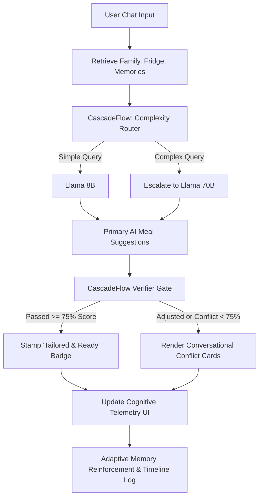

# ChefOS 🧠🍲

> **ChefOS** is a deterministic, self-learning household AI operating system that transforms recipe generation into a safe, memory-aware, and cost-efficient experience. Powered by the **Hindsight Memory Architecture** and **CascadeFlow Runtime Intelligence**, ChefOS goes beyond simple chatbot interfaces to act as an intelligent kitchen assistant.

---

## 🚀 Innovation & Real-World Impact (Rubric: Innovation 30% | Impact 10%)

Traditional recipe chatbots suffer from three major flaws that make them impractical for real-world kitchens:
1. **Ingredient Hallucination**: They recommend meals you can't cook, forcing you to go shopping.
2. **Unreliable Safety Rules**: Health notes, dietary needs (e.g., diabetics, reflux patients), and allergies are often ignored or forgotten in long conversations.
3. **Static Intellect**: They don't learn from feedback; you must write long prompts every time to explain what your family dislikes or likes.

### How ChefOS Solves This:
*   **Inventory Whitelist Verification**: Fridge inventory functions as a **hard constraint**. ChefOS will only recommend meals that are fully executable using the ingredients you already have.
*   **Deterministic Safety Verifier Gate**: A secondary LLM agent validates every generated recipe against family constraints *post-inference*, ensuring dangerous allergen/medical issues are completely blocked before they reach the user.
*   **Biomimetic Memory Loop**: Long-term family preferences and safety rules are learned, reflected upon, and adapted dynamically in the background without manual configuration.

---

## 🧬 Memory & Runtime Intelligence (Rubric: Hindsight & CascadeFlow 25%)

### 🧠 1. Hindsight Memory Architecture
ChefOS mimics human memory evolution through a three-stage pipeline:
1.  **Learn (Experiences)**: As you use the app, raw feedback (e.g., *"Mom felt bloated after the cheese dishes"* or *"Dad had acid reflux from the spicy dinner"*) is recorded as experiences.
2.  **Reflect (Mental Models)**: Periodically, ChefOS reflects on these experiences to synthesize high-level long-term rules (e.g., `Strict Health Constraint: Keep spice levels mild for Dad to prevent acid reflux`).
3.  **Recall & Adapt (Context injection)**: When brainstorming, relevant mental models are fetched using semantic lookup and injected directly into the LLM system context.
4.  **Self-Reinforcement**: Favorites and cooking actions increase rule confidence ratings. Verifier safety warnings automatically decrease confidence to align ChefOS with your household.

### ⚡ 2. CascadeFlow Runtime Intelligence
ChefOS manages model routing and validation to deliver low latency, reduced API costs, and robust safety:
*   **Dynamic Complexity Router**:
    *   **Simple Queries** (e.g., basic greetings, status checks) are routed to a fast, cost-efficient model (`llama-3.1-8b-instant`).
    *   **Complex Contexts** (e.g., family menu planning with multiple safety constraints and active memories) are escalated to an expert model (`llama-3.3-70b-versatile`).
*   **Post-Inference Verifier**: Evaluates the output recipe against the fridge whitelist and safety rules, computing a **Kitchen Alignment Score**.
*   **Caring UI/UX Overrides**: If the verifier flags a conflict, rather than showing a technical "Blocked Error", ChefOS renders caring glassmorphic cards:
    *   `✨ Almost Ready` (Amber Gradient): Missing a few ingredients. Offers interactive quick-actions like `📋 Copy Shopping List` or `➕ Add to Fridge`.
    *   `🛡️ Tailored for Comfort` (Blue Gradient): Adjusted recipe to keep family members safe (e.g., reflux-friendly mild meals).
    *   `⚠️ Important Health Guard` (Red Gradient): Blocked recipe containing allergen/severe medical conflicts.

---

## 📊 System Architecture



---

## 📱 User Experience & Demo Flow (Rubric: UX 15%)

ChefOS features a premium **glassmorphism user interface** designed to be intuitive, calming, and assistant-like. To demonstrate the system's runtime intelligence to judges, follow this flow:

### Flow A: The "Almost Ready" Conflict Card
1.  Navigate to the **Fridge Inventory** and remove `eggs`.
2.  Go to the **Daily Chat** and type: *"Suggest a quick dinner tonight using eggs"*.
3.  **The Result**: ChefOS detects that `eggs` are missing, and verifier gates the recipe. Rather than a system error, it displays an amber glassmorphic bubble:
    > **Almost Ready**  
    > Scrambled Eggs would work great, but **eggs** are missing.  
    > *🍳 Good news - Coconut Rice is fully ready to make right now.*
4.  Interact with the buttons inside the bubble:
    *   Click `📋 Copy Shopping List` to copy the list.
    *   Click `➕ Add to Fridge` to instantly replenish inventory and update your dashboard.

### Flow B: The "Comfort Adjustment"
1.  Go to **Family Settings** and add a note to Dad's profile: *"Dad suffers from acid reflux"*.
2.  Chat: *"Suggest a spicy curry dinner for Dad"*.
3.  **The Result**: ChefOS recalls Dad's reflux constraint, safety-gates the curry, and generates a soft-blue card:
    > **Tailored for Comfort**  
    > *"I have adjusted the recipe suggestions to fit safety rules."*  
    > *🛡️ Good news - Mild Lentil Soup & Roti is ready to cook.*

### Flow C: Real-Time Cognitive Telemetry
Look at the **Cognitive Telemetry** panel in the bottom corner during any generation to inspect:
*   **Active Routing Path** (e.g. `Llama 8B → Llama 70B → Verifier Gate`)
*   **Kitchen Alignment Score** (real-time integrity score percentage)
*   **Cognitive Strategy** (verifier's safety reasoning)
*   **Adjustments Made** (list of corrected parameters)

---

## 🛠️ Technical Implementation & Setup (Rubric: Code 20%)

### Tech Stack
*   **Frontend**: Vanilla HTML, CSS, JavaScript (Custom glassmorphism design tokens)
*   **Backend (DB)**: Node.js (Micro-server writing to local state files for persistent state)
*   **AI Models**: Groq API (`llama-3.1-8b-instant` and `llama-3.3-70b-versatile`)

### Installation & Run

1.  **Clone the Repository**:
    ```bash
    git clone https://github.com/ananthasail18/What_to_prepare.git
    cd What_to_prepare
    ```

2.  **Start the Database Server**:
    ```bash
    node server.js
    ```
    *Starts the persistent JSON DB server on port 3001.*

3.  **Start the Web Frontend**:
    ```bash
    npx serve .
    ```
    *Serves the glassmorphic frontend on port 3000.*

4.  **Add your API Key**:
    Open the app at `http://localhost:3000`, click the Settings icon (gear in top right), and paste your Groq API key securely.
